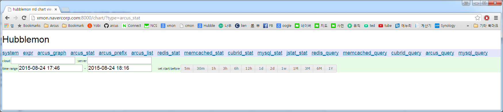

# Installation

Hubblemon is made up with below components.

* Hubblemon Web server
* collect server
* collect client

Collect clients is made by python scripts and it send client system, application stats to collect server.

Collect server receives clients stats and save it to disk then alarms if needed.

After clone Hubblemon on your system, you should modify settings.py like below.

# settings
## Common setting
There is settings.py in hubblemon/common directory.
This is a main setting file and you can change below lists.

#### collect_server_port
Set port of collect server. Default value is 30000

#### listener_list
Set port of collect listener and directory path to save stats. Default value is 30001 and 'collect_server/listener_30001'
This value should be set as tuple like below

	listener_list =[('%s:30001' % socket.gethostname(), 'collect_server/listener_30001', 'local')]

If there are many listeners, add them as list item.

#### main_link

	main_link = [   ('system', '/system'),
                ('expr', '/expr'),
                ('arcus_graph', '/graph?type=arcus_graph'),
                ('arcus_stat', '/chart?type=arcus_stat'),
                ('arcus_prefix', '/chart?type=arcus_prefix'),
                ('arcus_list', '/addon?type=arcus_list'),
                ('redis_stat', '/chart?type=redis_stat'),
                ('memcached_stat', '/chart?type=memcached_stat'),
                ('cubrid_stat', '/chart?type=cubrid_stat'),
                ('mysql_stat', '/chart?type=mysql_stat'),
                ('jstat_stat', '/chart?type=jstat_stat'),
                ('redis_query', '/query?type=redis_query'),
                ('memcached_query', '/query?type=memcached_query'),
                ('cubrid_query', '/query?type=cubrid_query'),
                ('arcus_query', '/query?type=arcus_query'),
                ('mysql_query', '/query?type=mysql_query') ]

Above default set will be shown like below on browser

Remove list item if you don't want to use.
And add list item if you make another plugin later.

#### chart_resolution

set chart size on browser

#### arcus_zk_addrs

In case of Arcus monitoring, If you set your arcus zookeeper address here.
Hubblemon get meta-data from arcus zookeeper and set cloud & server lists automatically.

## collect server

There is settings.py in hubblemon/collect_server directory.
This file is used for collect server and collect listener.

#### alarm_suppress

On default settings, collect client collect stats per every 5 secs.
And collect server receives that value and checks abnormal cases exists or not.

alarm_suppress is suppress time on same alarm events.
Default value is 12 hour

#### health_check

Make dummy alarm at health_check time.
Default value is '12:00'.

#### mail_server, mail_sender, mail_receivers

If you want to use mail as alarm method, You should set these values correctly.
mail_server is smtp server address,
mail_sender and mail_receivers are used at smtp protocols.

#### main_alarm init

main_alarm object is created and is inited on collect_server/settings.py like below.

Belows are default setting of main alarm
In this script, main_alarm have three alarm levels.
mail_info, mail_warning and sms_by_wget

mail_info is alarm by mail with [info] tag
mail_warning is alarm by mail with [warning] tag
sms_by_wget is alarm by wget call which invokes SMS.

    # allocate main alarm
    mail_info = alarm_mail.alarm_mail(mail_server, mail_sender, mail_receivers, prefix='[Info]')
	mail_warning = alarm_mail.alarm_mail(mail_server, mail_sender, mail_receivers, prefix='[Warning]')
	sms_by_wget = alarm_wget.alarm_wget(wget_callback)

    main_alarm = alarm.main_alarm(alarm_suppress, health_check)

    # [ mail_info, mail_warning, sms_by_wget ]
    main_alarm.alarm_methods.append(mail_info)
    main_alarm.alarm_methods.append(mail_warning)
    main_alarm.alarm_methods.append(sms_by_wget)

And below script add plugins which main alarm should check.
You can add or remove plugins from below scripts.
Each alarm cases are described at hubblemon/*_mon/settings.py which you can change.

    # add client plugins
    from arcus_mon.arcus_alarm import arcus_alarm
    main_alarm.add_plugin(arcus_alarm())

    from psutil_mon.psutil_alarm import psutil_alarm
    main_alarm.add_plugin(psutil_alarm())

    from cubrid_mon.cubrid_alarm import cubrid_alarm
    main_alarm.add_plugin(cubrid_alarm())

    from mysql_mon.mysql_alarm import mysql_alarm
    main_alarm.add_plugin(mysql_alarm())

    from memcached_mon.memcached_alarm import memcached_alarm
    main_alarm.add_plugin(memcached_alarm())

    from redis_mon.redis_alarm import redis_alarm
    main_alarm.add_plugin(redis_alarm())

## collect client

You should copy hubblemon/collect_client to your clients which will be monitored.

Then edit run_client.py before run.
In that file, you should change collect server addresses and add plugins to collect and send to server

Default run_client.py template is like below.
    from collect_client import *
    from client_psutil_plugin import psutil_stat
    from client_arcus_plugin import arcus_stat
    from client_memcached_plugin import memcached_stat
    from client_redis_plugin import redis_stat
    from client_cubrid_plugin import cubrid_stat
    from client_mysql_plugin import mysql_stat
    from client_jstat_plugin import jstat_stat

    server_address = ['1.1.1.1:40000', '2.2.2.2:40000'] # your collect server address

    if True:
            c = collectd(hostname, server_address)
    else:
            # use stacking if network response is too low
            c = collectd(hostname, server_address, stack=10)

    """
    # arcus stat example
    arcus = arcus_stat()
    arcus.auto_register()
    c.plugins.append(arcus)

    # memcached stat example
    mc = memcached_stat()
    mc.auto_register()
    c.plugins.append(mc)

    # mysql stat example
    my = mysql_stat()
    my.push_db('dbname', 'mysql.sock_path', 'id', 'pw')
    c.plugins.append(my)

    # cubrid stat example
    cub = cubrid_stat()
    cub.auto_register()
    c.plugins.append(cub)

    # jstat stat example
    js = jstat_stat()
    js.auto_register(['java', 'apache', 'catalina'])
    c.plugins.append(js)
    """

    # system stat (psutil) example
    ps = psutil_stat()
    c.plugins.append(ps)

    c.daemon()

With this default template file.

First, change server_address to your collect_server addresses. 
server_address is list type because there is many collect_server address (For High availibility)

Then add plugins which you want to collect on your clients.
In default template file, only a psutil_stat plugin is added to collectd daemon and other plugins are commented.

If you want to collect arcus stat. uncomment that block which is like below. 

    # arcus stat example
    arcus = arcus_stat()
    arcus.auto_register()
    c.plugins.append(arcus)

Now, collectd daemon includes arcus_stat plugin.

arcus_stat, memcached_stat, cubrid_stat supports auto_register()
That interface check system processes and collect application stat by itself automatically. so you don't have to add any other information. (You can also add infomation manually)

mysql_plugin needs datebase name, mysql socket, id and password to collect mysql stats corectly.

jstat_plugin needs filter words to find correct java process.
In default run_client.py, It shows ['java', 'apache', 'catalina'] as that parameter. And jstat_stat collect process which contains 'java', 'apache', 'catalina' in it's run time parameters. (That means.. tomcat)

# Run
## collect server & listener

In hubblemon/collect_server directory, You can run collect server & listener like below

    nohup python3 run_server.py &
    nohup python3 run_listener.py &

## collect clients

After set up settings.py in hubblemon/collect_client directory.
run collect clients like below

	nohup python3 run_client.py &

## hubblemon webserver

hubblemon web is made by Django.
Run it like below. (IP should be correct)

	nohup python3 manage.py runserver [YOUR_IP]:[PORT] &

